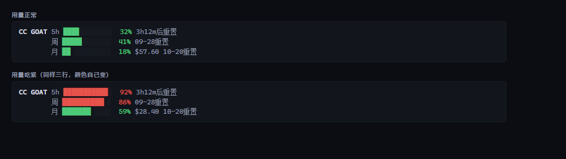

# Command Code Usage

See how much of your **Command Code** plan is left — 5-hour, weekly and monthly windows
with reset times — **in the Claude Code status line**.

Runs on your machine. No model round-trip, so **checking your quota costs no quota**.



```
CC GOAT │ 5h █▎░░░░░░░░ 12% 4h27m后重置 │ 周 █▏░░░░░░░░ 11% 09-27重置 │ 月 ▋░░░░░░░░░ 6% $66.03 10-20重置
```

[简体中文](README.zh-CN.md) · [What was verified](docs/FINDINGS.md)

[](https://github.com/Jovan1666/claude-code-command-code-usage/actions/workflows/check.yml)

---

## Install

```
/plugin marketplace add Jovan1666/claude-code-command-code-usage
/plugin install commandcode-usage@commandcode-usage
node ~/.claude/plugins/marketplaces/commandcode-usage/scripts/setup.mjs
```

The first two are Claude Code's own commands. The third is the installer, run from the
marketplace checkout that the first one created — it is the step that puts the line in your
status bar. Nothing asks for your API key up front; the script finds it — see
[Credentials](#credentials).

### Why the install needs a setup script

Claude Code keeps its status line in the **user's** config, and it does not let a plugin
declare one — a plugin `settings.json` accepts only `agent` / `subagentStatusLine`. So the
last step is a script that writes that one setting for you. It backs up what was there,
refuses to overwrite someone else's status line unless you pass `--force`, and `--remove`
puts yours back.

## What it shows

| Window | Meaning | On GOAT |
|---|---|---|
| 5-hour | Rolling burst limit — one long session cannot drain the month | $14 |
| Weekly | Rolling 7-day limit | $35 |
| Monthly | The billing period's credit allowance | $70 |

Each window shows **percent used**, a bar, and **when it resets** (a countdown under a day,
a date beyond that). The monthly one also shows the credit left.

Colors follow how full the window is — green under 60 %, amber to 85 %, red above. (The
terminal and HTML panels use a slightly earlier 50 / 80 split; the status line is the one that
had to be tuned for a glance, so it warns later.)

Plans with no rolling windows (Provider, Enterprise) show the balance alone.
Plans without API access (Go) render nothing at all in the status line — no error, no empty
box. Ask for the terminal panel on such a plan and it *does* fail loudly, because there you
asked a direct question and silence would be the wrong answer.

## It hides itself when you are not using it

If you configured Command Code but switched to another model, a permanent quota bar is noise.
The script decides **per turn** whether this session is actually routed there:

1. **Your local router's own mapping** — tools like `cc-switch` write
   `ANTHROPIC_DEFAULT_OPUS_MODEL` / `..._MODEL_NAME` pairs into the env; the script reads the
   pair to learn the real upstream model. This is the router's own configuration, not a guess.
   (This one is an inference rather than a measurement — see
   [what was verified](docs/FINDINGS.md) — so if it ever comes up empty the script falls
   through to the next level rather than guessing.)
2. **The model name the host hands over directly** — Claude Code sends an object here rather
   than a plain string, so on this platform the script moves on to level 3.
3. **The session transcript** — the model each message actually used
   (`message.model`).
4. **Account activity** — fallback, only when the three above say nothing.

The resolved model is checked against Command Code's public model catalog
(`/provider/v1/models`, no auth needed). Not in the catalog → hidden.

Some model names are genuinely ambiguous (a bare `claude-opus-5` exists both natively and in
Command Code's catalog), and those are deliberately **not guessed** — add your own with
`--model <substring>` instead.

## Commands

The plugin also installs a `/quota` command that prints the compact panel.
**That one does go through the model** — it is a prompt, so it costs a turn; the status line
is the free path, and `/quota` is for when you want the numbers in the transcript.

## Credentials

Found automatically, in this order:

1. `COMMAND_CODE_API_KEY` / `COMMANDCODE_API_KEY` / `CMD_API_KEY`
2. any env var whose name contains `commandcode`
3. `~/.commandcode/auth.json` (the official CLI's login state)
4. a Command Code provider route in `~/.claude/settings.json`

If nothing is found the status line simply does not render — it never prints an error into
your editor.

## Layout

```
scripts/cc-usage.mjs     ← the implementation (CLI, status line, gating, credentials)
scripts/setup.mjs        ← writes the statusLine entry into ~/.claude/settings.json
commands/quota.md        ← the /quota command
docs/FINDINGS.md         ← what was measured, and what to revisit when things change
```

## Requirements

- Node 18+
- A Command Code plan with API access — the `$1` Go tier does not have one
- **Windows:** Claude Code runs status line commands through Git Bash when it is installed,
  through PowerShell when it is not. Git Bash itself costs ~29 ms per repaint, and PowerShell
  roughly three times that — so if repaints feel slow, install Git Bash.

## A note on pacing warnings

The script computes a burn-rate projection. **The status line never shows it**; the terminal
panel, `--compact`, `--md` and `--html` still print it, and `--json` always carries it.

It stays out of the status line for a reason: extrapolating from a short sample says "you will
run out" almost every time — 25 minutes into a 5-hour window a normal burst projects to 140 % —
and a warning that is always on is not a warning. Where it *is* printed you asked for a panel,
so the extra line costs you nothing.

## Contributing

```sh
node scripts/check.mjs          # everything: rendering, gating, thresholds, formats, secrets, the installer
node scripts/check.mjs --quiet  # one line per suite
```

That is the same script CI runs, so a local pass means a green build.

`scripts/cc-usage.mjs` is the implementation — edit it directly. `scripts/setup.mjs` is the
only thing here that writes to your machine outside the cache
(`~/.claude/settings.json`, after a timestamped backup).

## License

MIT — see [LICENSE](LICENSE).
